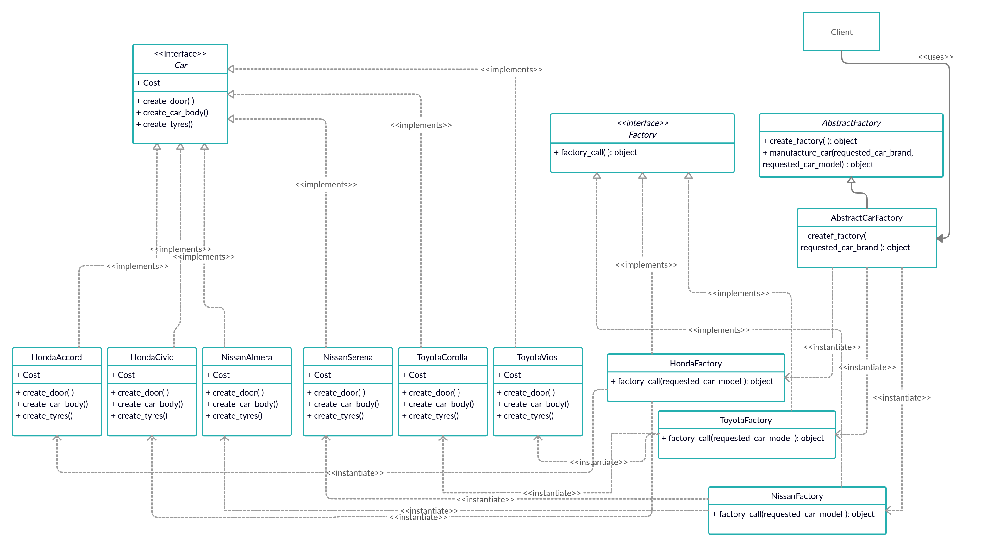

# Factory Method

### Brief explanation
- Shares the same concept with the Factory method.
- This pattern is to be used when dealing with variations of different classes. For example, if sofa, table and cupboard are classes then their variations are 3-seat sofa and 2-seat sofa, dinner table and living-room table, and kitchen cupboard and bedroom cupboard.
- The difference between the Abstract Factory method and Factory method is another layer of abstraction. The Abstract Factory returns a Factory that can produce the variations of a certain class as objects. 
- This separation enables the scaling of the classes to be more organized and hidden from the client codes as well as solving the problem of the client needing to know the exact name of the concrete classes and the need to create objects on-the-fly during runtime.
- This method respects the **Open-Closed Principle** in software engineering which states that _Software engitites should be open for extension but closed for modification_.

### Example with Solution
Say that a car manufacturing company currently manufactures 3 brands of cars. Toyota, Honda, and Nissan. Each of this brands has 2 models. Honda Civic, Honda Accord, Nissan Almera, Nissan Serena, Toyota Vios, and Toyota Corolla. Doors, tyres and car body has to be added for every car according to their brand and model. The cost of adding these parts depends on the brand and the model. Using the abstract factory method, the UML Class Diagram for this software might look like below.

The _Car_ class is an interface. Every brand and model of car has to implement and override the public methods from the interface. Also, every class has to implement the cost variable which is used to keep track of the cost of adding car parts to the car. 

The _Factory_ is an interface class that must be implemented by every factory. There is only 1 public method that has to be implemented by every factory. This method returns the object of the car according to their model.

The _AbstractFactory_ is an abstract class. It has 2 public methods. In this case, this abstract class is unnecessary as we only have 1 abstract factory class. However, should we have more than 1 abstract factory, then this abstract class will be useful to keep track of every abstract factory class and make them consistent. The manufacture_car method will automatically add all the car body parts to the car and returns the object of the car after manufacturing it.

**NOTE THAT** : The client can also invoke the methods in every Car object as the client may get their information from the interface class. This does not violate any principle of this method.

**HondaAccord**, **HondaCivic**, **ToyotaCorolla**, **ToyotaVios**, **NissanAlmera**, and **NissanSerena** are concrete classes that implements the interface class _Car_. **HondaFactory**, **ToyotaFactory**, and **NissanFactory** are the concrete classes that inherits the _Factory_ interface class. The 6 concrete classes of cars are ONLY accessible by **HondaFactory**, **ToyotaFactory**, and **NissanFactory** according to their brand.

Whenever the client code requires a concrete class of a specific car, the client does not need to know anything about the instantiation of the class. Instead, the Client communicates with the **AbstractFactory** class to get the object of the concrete class car through the respective factories.

### Why?

It is entirely possible for the solution to not use the Abstract Factory class and instead the client instantiate and call the concrete class of the required car directly. However, this also means that the client has to know the exact name of the concrete classes. This would result in hard-coding the logics in the client-side thus making the code hard to read or reuse when more concrete classes need to be added. By using the abstract factory method, the logics and instantiations can be hidden from the client side thus making the code more organized and readable. 

Unfortunately this also results in many smaller files in the program to keep track of the the client codes and the factory codes.