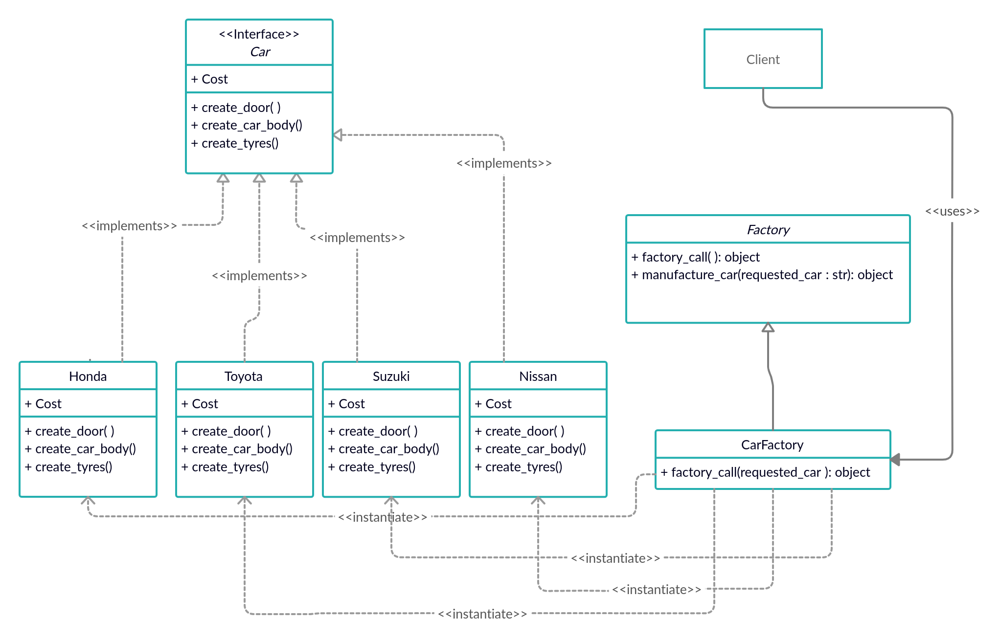

# Factory Method

### Brief explanation
- The factory method separates the client code and the concrete classes.
- The client should now have any knowledge about the instantiation of the concrete classes except the conventional names defined in the factory class itself.
- The factory class/method will return ONLY the object of the required concrete class when required by the client code.
- This separation enables the scaling of the classes to be more organized and hidden from the client codes as well as solving the problem of the client needing to know the exact name of the concrete classes and the need to create objects on-the-fly during runtime.
- This method respects the **Open-Closed Principle** in software engineering which states that _Software engitites should be open for extension but closed for modification_.

### Example with Solution
Say that a car manufacturing company currently manufactures 4 brands of cars. Toyota, Honda, Suzuki, and Nissan. Doors, tyres and car body has to be added for every car according to their brand. The cost of adding these parts depends on the brand. Using the factory method, the UML Class Diagram for this software might look like below.

The _Car_ class is an interface. Every brand of car has to implement and override the public methods from the interface. Also, every class has to implement the cost variable which is used to keep track of the cost of adding car parts to the car.

The _Factory_ is an abstract class that has 2 public methods. In this example, this abstract class is unnecessary. However, in the event that more than 1 factory is needed, this abstract class will be responsible to keep the methods in the factories consistent and in check. The _Factory_ class can also have methods that will be inherited by all concrete factories for a common purpose. In this example, the "manufacture_car" is such method.

**Honda**, **Toyota**, **Suzuki**, and **Nissan** are concrete classes that implements the interface class _Car_. **CarFactory** is the concrete class that inherits the _Factory_ abstract class. The concrete classes (Honda, Toyota, Suzuki, and Nissan) are ONLY accessible by **CarFactoy**.

Whenever the client code requires a concrete class of the Car, the client does not need to know anything about the instantiation of the class. Instead, the Client communicates with the **CarFactory** class to get the object of the concrete class car.

**NOTE THAT** : The client can also invoke the methods in every Car object as the client may get their information from the interface class. This does not violate any principle of this method.

### Why ?

It is entirely possible for the solution to not use the Factory class and instead the client instantiate and call the concrete class of the required car directly. However, this also means that the client has to know the exact name of the concrete classes and the methods in it. This would result in hard-coding the logics in the client-side thus making the code hard to read or reuse when more concrete classes need to be added. By using the factory method, the logics and instantiations can be hidden from the client side thus making the code more organized and readable.

Unfortunately this also results in many smaller files in the program to keep track of the the client codes and the factory codes.