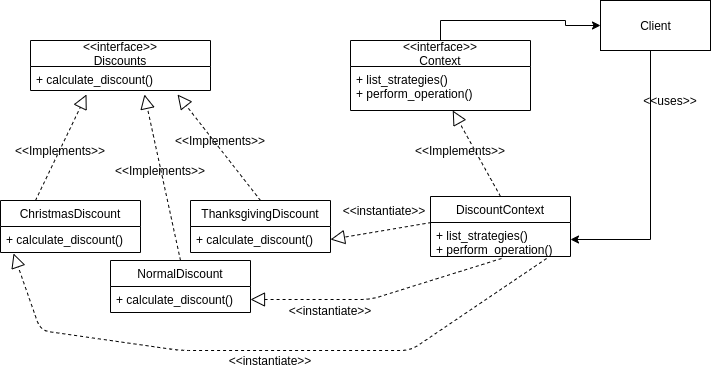

# Factory Method

### Brief explanation
- **A.k.a.** Policy method.
- This method is often used to select an algoritm at run-time to achieve a certain task.
- This method allows the developer to define a _family of algorithms_ (because we're interested in different algorithms that performs similar tasks), encapsulate each one thus hiding the complexity of an algorithm from the client and enables the interchangeability of the algorithms usage.
- At first glance, this method might look the same as the factory method. However, there is one major difference between these both algorithms. Factory method returns an object of the desired class while strategy method performs a set of desired operation on the given input and returns the output.

### Example with Solution
Say that you are the chief developer of an app that let a user to order foods/beveragees and get it delivered to his/her doorstep. To attract more customers, your boss has decided to give discounts to the users. You implement the algorithm that calculates the prices of ordered foods after the discount and soon enough your customers are happy. Again, your boss has decided to introduce another different discount. You implement this new algorithm in the same manner as you did before as another method in the same class as before. Soon enough, as more and more discounts are being introduced, you realize that your codes are getting messier and harder to maintain. Using the strategy design pattern for this scenario, the codebase becomes more manageable and maintainable. The UML diagram for this example is shown below.

The client only deals with a class called DiscountContext. The logics of all the discount calculations are completely hidden from the client side. During runtime, the client code specifies which algorithm to be used and DiscountContext will perform the discount calculation for the client using the desired algorithm. The interface class Discounts makes sure that all the discount calculation algorithms implements a method called "calculate_discount" to ensure that the DiscountContext class will be able to access them and get the desired output. The Context interface class makes sure that any Context class such as DiscountContext has some operation to perform and at the same time list all the available algorithm names. This will ensure the separation between client and the algorithm logics.

### Why?

As a software grows larger, there might be newer algorithms needed to be implemented to cater a similar use-case. If we write the new algorithms in the same class or just as another method and use it at the client side, the code that handles algorithm invoking at client side will soon becomes very messy and hard to be maintained. The client side has to know the specifics of each algorithm in order to use it. If more than one developers are working on such a project, this will only cause miscommunications and delays. By encapsulating the algorithms on one side, standardizing them with the interface class and providing the context class for the client side code will make the whole process easier.

However, if there are only a few algorithms in use, there is no real reason to implement this pattern since the algorithms would still be manageable and implementing this pattern will only complicate the code readings further.
